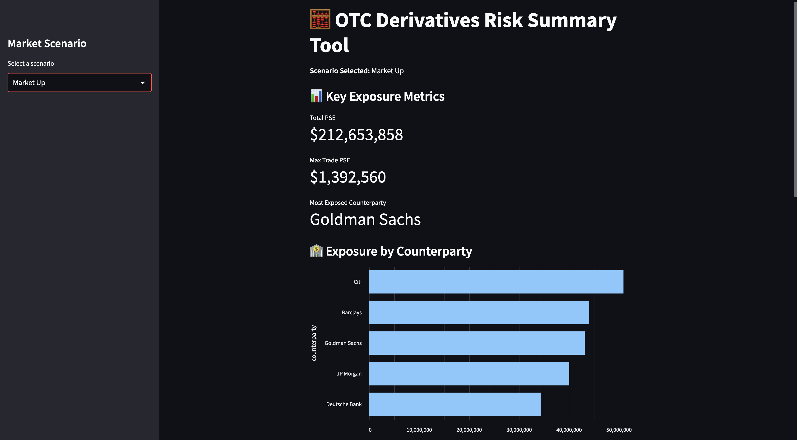
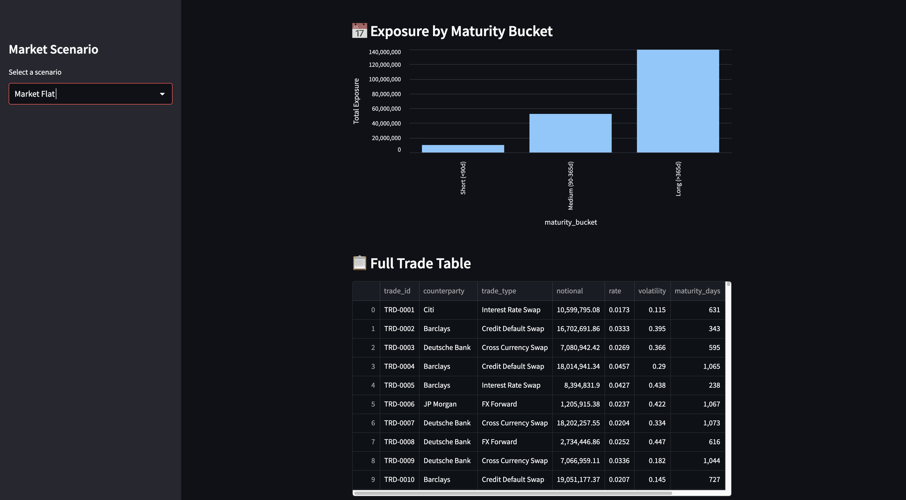
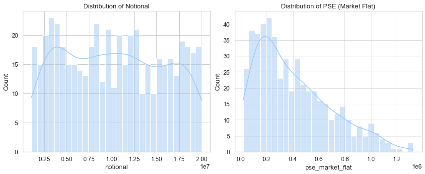

# 🧮 OTC Derivatives Risk Summary Tool

A Streamlit-based interactive tool that simulates, calculates, and visualizes **pre-settlement exposure (PSE)** of OTC derivative trades under various market scenarios.

---

## 🚀 Project Overview

Over-the-counter (OTC) derivatives come with counterparty risk—what if one party defaults before the trade settles? This tool helps assess that risk by calculating **pre-settlement exposure** based on synthetic trade data and simulating market stress scenarios.

---

## 📚 What We Learned

- How OTC derivatives work and why **exposure monitoring** matters
- How to simulate realistic financial datasets using Python
- How to build a **simplified risk calculator** with a PSE formula:
  
   #### PSE = Notional × Rate × (1 + Volatility) × Scenario Factor

- How to conduct Exploratory Data Analysis (EDA) to:
- Detect exposure concentration by counterparty
- Analyze trade maturity buckets
- Understand PSE distribution
- How to build an interactive risk dashboard with **Streamlit + Altair**

---

## 📊 EDA Insights

### 🔸 Exposure by Counterparty
We found entities like **Goldman Sachs** and **Citi** had the highest total exposure in the simulated dataset.



---

### 🔸 Exposure by Maturity Bucket
Majority of the risk lies in **long-term trades (> 365 days)**, followed by medium-term trades.



---

### 🔸 Distribution of Notional and PSE
The notional distribution was uniform, but PSE was **right-skewed**, suggesting a few large exposure trades dominate.



---

## 🛠️ Tech Stack

- **Python**: Data generation, processing
- **Streamlit**: App UI
- **Altair & Seaborn**: Data visualizations
- **Pandas + NumPy**: Data wrangling
- **JSON**: Scenario configuration

---

---

## 📈 Run the App Locally

```bash

pip install streamlit pandas altair
streamlit run app.py

